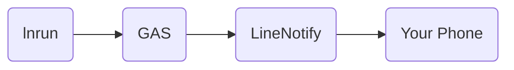

# lnrun

Line Notify after runing a shell commands.

## Goal
Receive notify after running a command.


## Requirement
1.	A Google Account
2.	A Line Account
3. Python 3.6+

## How To Setup
1. Go to [Line Notify ](https://notify-bot.line.me/), and login to your account.
2. Click right top and select My page.
3. Generate access token (you can create a new group for notify bot) and copy that token for Step 6.
4. Go to Google App Script (GAS) and create new project.
5. Copy everything in lnrun/GAS/code.js into your code.gs.
6. Replace 'your code here' with token from Step 3.
7. Next, go to "Deploy" on right top, and select "New deployment". Then on next page click gear, and select Web App.
 
8. In "Who has access" selcet "Anyone". (you may want to edit this page too) And click "Deploy".
9. After it finish processing, you will get your url for this web app. And copy that url.
10. Install lnrun using pip.
```
pip install lnrun
```
11. Paste url to lnrun configs. (Note: configs will only save in your local machine.)
```
lnrun set_config script_path https://url.here
```
Now your good to go.

## How To Use

```
lnrun [commands]
```
For example: my command is:
```
python train.py --config config/train.yaml
```
Using lnrun just add lnrun before it:
```
lnrun python train.py --config config/train.yaml
```

## Configs
You can find all configs by running:
```
lnrun get_configs
```
Set config 
```
lnrun set_config config_key config_value
```
## Known Issue

1. send_errors is not working when using tqdm. (Since both of them uses stderr)

