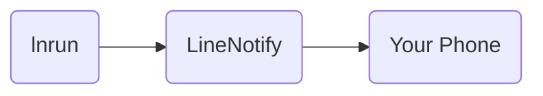

# lnrun

Line Notify after runing a shell commands.

## Goal
Receive notify after running a command.


## Requirement
1.	A Line Account
2. Python 3.6+

## How To Setup
1. Go to [Line Notify ](https://notify-bot.line.me/), and login to your account.
2. Click right top and select My page.
3. Generate access token (you can create a new group for notify bot) and copy that token for Step 6.
4. Install lnrun using pip.
```
pip install lnrun
```
5. Paste url to lnrun configs. (Note: configs will only save in your local machine.)
```
lnrun set_config line_token https://url.here
```
Now your good to go.

## How To Use

```
lnrun [commands]
```
For example: my command is:
```
python train.py --config config/train.yaml
```
Using lnrun just add lnrun before it:
```
lnrun python train.py --config config/train.yaml
```

## Configs
You can find all configs by running:
```
lnrun get_configs
```
Set config 
```
lnrun set_config config_key config_value
```
## Known Issue

1. send_errors is not working when using tqdm. (Since both of them uses stderr)

